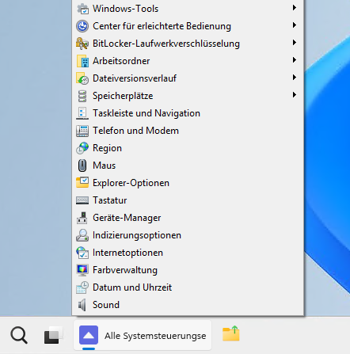
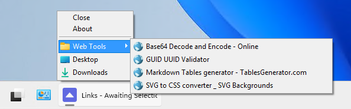
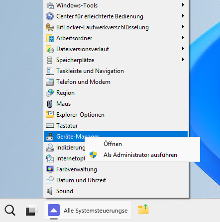
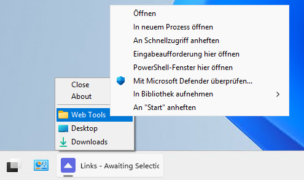

# WinPinMenu
diVISION Pinnable Taskbar Menu For Windows

WinPinMenu is a small portable application designed to replace functionality of Windows taskbar that was removed in recent releases of Windows 11: custom toolbars and quick launch. While created for this specific purpose, WinPinMenu very well can be used in any version of Windows (from 7 onwards). It allows users to pin popup menus to the taskbar displaying contents of arbitrary folders and launch items from there. It is extremely lightweight and runs only to display the menu, thus consumes no resources in the background, it neither requires shell extensions nor patching of Windows components.

## Screenshots
*Control Panel - `shell:ControlPanelFolder` (German Windows)*

*Links - `shell:Links` (German Windows)*

## Download And Install
Go to [Releases](https://github.com/hatelamers/WinPinMenu/releases), select an asset suitable for your operating system and download it.

WibPinMenu doesn't require an installation but if you have downloaded an installer just run it, for ZIP ditribution - extract the contents somewhere convenient, the application executable will be in `bin` subfolder.

## Using The App
You can pin as many instances of WinPinMenu to a taskbar as you wish (and there is space), each instance expects a folder path or ID as parameter to render it as a menu. The recommeneded procedure to achieve this is the following:

1. Click with the right mouse button on the `WinPinMenu.exe` and select "Create Shortcut"
1. Give the shortcut file a name which will be displayed on the taskbar button
1. Open shortcut properties (right mouse button)
1. Put the cursor in the "Target" field at the very end
1. Press space bar
1. Enter a folder path or ID to be rendered in the popup menu (for possible formats s. [Folder Identifiers](#folder-identifiers) below)
1. Optionally chage the icon of the shortcut (will be visible in the taskbar)
1. Apply the changes
1. Right click on the shortcut file an select "Pin To The Taskbar"
1. After a new pin icon appears on the taskbar the shortcut file itself is no longer needed and can be deleted

### Folder Identifiers
Generally virtually anything that Windos Explorer would accept in its address bar can be used. Particularly WinPinMenu supports any of these identifier formats:

- Absolute path to a folder, i.e. `C:\Users\Michael\Links`
- Folder path containing environment variables, i.e. `%USERPROFILE%\Links`
- Named shell identifier like `shell:Links` (for comprehensive list s. https://pureinfotech.com/windows-11-shell-commands-list)
- Shell known folder CSIDL like `shell:::{323CA680-C24D-4099-B94D-446DD2D7249E}` (for comprehensive list s. https://www.elevenforum.com/t/list-of-windows-11-clsid-key-guid-shortcuts.1075/)

For all formats applies: if an identifier containes spaces it must be enclosed in double quotes when used as WinPinMenu parameter.

### Extended Actions
Most items in the popup menus can perform extended actions available via context menu (right mouse click), even more of them are accessible via right mouse click when shift key is pushed.

*Richt Click - Control Panel - `shell:ControlPanelFolder` (German Windows)*

*Richt Click + Shift - Links - `shell:Links` (German Windows)*

### Limitations
Due to the nature of Windows menu API the application would display max. 15 levels of nested folders and up to 4095 items in each folder - if you call this a limitation.